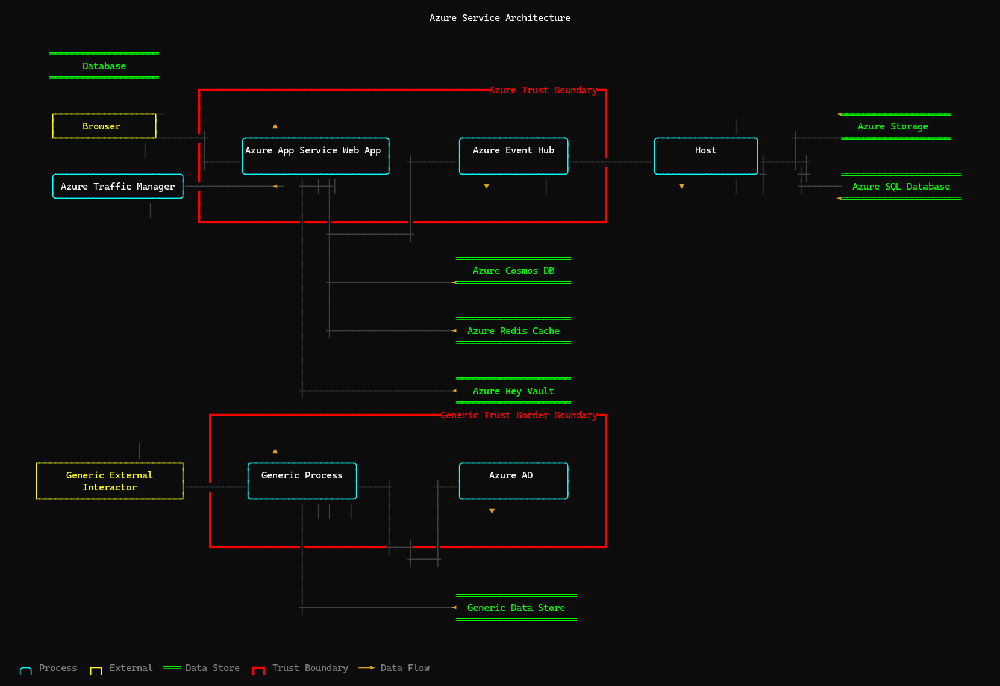

# tm7 CLI

A command-line tool for constructing, interrogating, and modifying Microsoft Threat Modeling Tool (`.tm7`) files — designed for use by humans and AI assistants alike.

## Features

- **Open & inspect** — summarize models, list entities and data flows
- **Create & modify** — add/remove entities and flows, create new models from templates
- **Import** — convert Graphviz DOT diagrams into `.tm7` format
- **Render** — visualize threat model diagrams directly in the terminal with Unicode box-drawing and ANSI colors
- **Round-trip fidelity** — uses `DataContractSerializer` with DTO classes matching the TM7 XML format

## Install

### Download a prebuilt binary (recommended)

Self-contained, single-file NativeAOT binaries are published for every release —
no .NET runtime required. Download the archive for your platform from the
[latest release](https://github.com/gholliday/tm7-cli/releases/latest):

| Platform | Asset |
| --- | --- |
| Windows x64 | `tm7-win-x64.zip` |
| Windows arm64 | `tm7-win-arm64.zip` |
| Linux x64 | `tm7-linux-x64.tar.gz` |
| Linux arm64 | `tm7-linux-arm64.tar.gz` |
| macOS x64 (Intel) | `tm7-osx-x64.tar.gz` |
| macOS arm64 (Apple Silicon) | `tm7-osx-arm64.tar.gz` |

Each release also includes `checksums.txt` (SHA-256) and `release-metadata.json`
for verification.

Graphviz provides all automatic model layout and DOT import. Install it with
`winget install Graphviz.Graphviz` on Windows, `brew install graphviz` on macOS,
or your Linux package manager (for example, `apt install graphviz`). The CLI
finds `dot` on `PATH` or in Graphviz's standard Windows install directory; use
`TM7_GRAPHVIZ_DOT` or `--graphviz-dot <path>` to override it for DOT imports.

> **Breaking changes from the initial preview**
> - `add entity` no longer accepts manual `--left`, `--top`, `--width`, or
>   `--height` options. Graphviz owns placement; use `--boundary` for
>   containment.
> - `add entity`, `add flow`, `remove`, `layout`, `render`, and `import dot`
>   require Graphviz. Use `--no-layout` while constructing a batch.
> - `new`, `open`, and `list` remain usable without Graphviz.

> **Platform notes**
> - **Linux** binaries are built against glibc 2.39 (Ubuntu 24.04), so they require
>   a glibc-based distro of that vintage or newer (e.g. Ubuntu 24.04+, Debian 13+,
>   RHEL/Rocky 10+, Fedora 40+). They are not built for musl/Alpine.
> - **macOS** binaries are not code-signed or notarized. If you download via a
>   browser, Gatekeeper quarantines the file; clear it with
>   `xattr -d com.apple.quarantine ./tm7` (downloading with `curl`, as above, avoids this).

### Build from source

Requires [.NET 10 SDK](https://dotnet.microsoft.com/download/dotnet/10.0).

```bash
# Clone and build
git clone <repo-url>
cd tm7cli
dotnet build

# Run directly
dotnet run --project src/Tm7.Cli -- <command>

# Or install as a global tool
dotnet pack
dotnet tool install --global --add-source artifacts/package/release tm7
tm7 --help
```

## Quick start

```bash
# Inspect a model
tm7 open model.tm7
tm7 list entities model.tm7
tm7 list flows model.tm7

# Create a new model from the bundled Azure template (use --template to override)
tm7 new mymodel.tm7 --name "My Threat Model"

# Add entities
tm7 add entity mymodel.tm7 \
  --name "Web API" \
  --type-id SE.P.TMCore.AzureAppServiceWebApp \
  --generic-type-id GE.P

# Add a data flow (use GUIDs from 'list entities')
tm7 add flow mymodel.tm7 \
  --name "HTTPS Request" \
  --source <source-guid> \
  --target <target-guid>

# Render the diagram in terminal
tm7 render mymodel.tm7

# Import from Graphviz DOT (Graphviz computes the node layout)
tm7 import dot architecture.dot --output model.tm7

# Show all usage examples
tm7 examples
```

## Commands

| Command | Description |
|---------|-------------|
| `open <file>` | Show model summary (surfaces, entity/flow counts, threats) |
| `list entities <file>` | List all entities with type, position, surface |
| `list flows <file>` | List all data flows with source/target |
| `add entity <file>` | Add an entity (process, external interactor, data store, boundary) |
| `add flow <file>` | Add a data flow between two entities |
| `add surface <file>` | Add another drawing surface to the model |
| `remove entity <file>` | Remove an entity and its connected flows |
| `remove flow <file>` | Remove a data flow |
| `new <file>` | Create an empty model from a template |
| `import dot <dotfile>` | Import a Graphviz DOT file into tm7 format |
| `layout <file>` | Apply Graphviz layout to an existing model |
| `render <file>` | Render the diagram in the terminal |
| `examples` | Show usage examples and entity type reference |

Graphviz layout is automatic. Adding or removing an entity or flow immediately
re-lays out every drawing surface, and `render` applies the same layout in
memory. Entity coordinates are intentionally not accepted by `add entity`.
Use `--boundary <guid>` to place an entity within a trust boundary. Run
`tm7 layout model.tm7` once to update an existing manually positioned model.

For batch construction, pass `--no-layout` to each `add entity` and `add flow`,
then run `tm7 layout model.tm7` once after the topology is complete. Deferred
adds use safe temporary geometry, avoiding failures caused by incomplete
intermediate graphs. Use `tm7 add surface model.tm7 --name "Runtime"` together
with `--surface <index>` to keep related subsystem diagrams in one model.

`import dot` respects the DOT graph's `rankdir`; generated layouts default to
left-to-right (`LR`). Graphviz coordinates are stored in the `.tm7` model so
Microsoft Threat Modeling Tool and `tm7 render` use the same placement.
Graphviz also selects obstacle-aware connector routes. The `.tm7` file stores
the resulting source and target ports plus a bounded curve handle that
approximates the route without producing extreme arcs. Parallel and reverse
flows use separate lanes. Each endpoint is projected from the final curve
handle onto the nearest point of the node perimeter, and its 8-way TM7 port is
selected from the same direction so curves do not cross node labels. The
terminal renderer uses the complete orthogonal Graphviz route. A global rank
pass aligns connected trust-boundary clusters,
reducing long fan-out crossings between hub and dependency groups. Large
layouts are scaled into TM7's supported coordinate range before serialization
so Microsoft Threat Modeling Tool does not auto-correct the model.
Flow labels are represented as invisible Graphviz obstacles during layout, so
their persisted handle positions do not overlap shapes, boundary captions, or
other flow labels.

Dense surfaces are evaluated in both left-to-right and top-to-bottom
orientations. The CLI scores node and root-boundary overlap, compacts residual
readable-width collisions, packs root clusters as units, and uniformly fits
borders, labels, and routes together into the TM7 coordinate range. Flows are
never dropped to make a layout fit.

Existing line trust boundaries are mapped proportionally into the final entity
coordinate frame so relayout does not leave their geometry behind.

## Entity types

| GenericTypeId | Shape | Example TypeIds |
|---------------|-------|-----------------|
| `GE.P` | ╭─╮ Process (ellipse) | `SE.P.TMCore.AzureAppServiceWebApp`, `SE.P.TMCore.AzureAD`, `SE.P.TMCore.Host` |
| `GE.EI` | ┌─┐ External Interactor (rectangle) | `SE.EI.TMCore.Browser`, `GE.EI` |
| `GE.DS` | ═══ Data Store (parallel lines) | `SE.DS.TMCore.AzureStorage`, `SE.DS.TMCore.AzureSQLDB`, `SE.DS.TMCore.AzureKeyVault` |
| `GE.TB.B` | ┏━┓ Trust Boundary (bold border) | `SE.TB.TMCore.AzureTrustBoundary`, `GE.TB.B` |

## Terminal rendering

The `render` command produces a Unicode diagram with ANSI color support:



The model shown above is available as [`samples/readme-demo.tm7`](samples/readme-demo.tm7);
its editable Graphviz source is [`samples/demo.dot`](samples/demo.dot).

- **Processes**: cyan rounded boxes (`╭╮╰╯`)
- **External Interactors**: yellow sharp boxes (`┌┐└┘`)
- **Data Stores**: green parallel lines (`═══`)
- **Trust Boundaries**: red bold borders (`┏┓┗┛`)
- **Data Flows**: gray lines with colored arrows (`►◄▼▲`)
- **Annotations**: dim gray text

Options: `--width`, `--height`, `--plain` (no ANSI codes, for piping/AI consumption).

### Key design decisions

- **Serialization**: Uses `DataContractSerializer` with an explicit known-types list — this is the only reliable way to produce valid `.tm7` files
- **DTOs**: The `Tm7Model/` directory contains DataContract DTO classes derived from the public `.tm7` XML format. They use explicit `[DataContract(Namespace = "...")]` attributes to match the XML namespaces that `DataContractSerializer` expects.
- **Rendering**: Uses [Hex1b](https://github.com/mitchdenny/hex1b) `Surface` as a character-cell canvas, with custom ANSI output to handle the unwritten-cell marker (`\uE000`)

## Releasing

Releases are produced by the [`Release` workflow](.github/workflows/release.yml),
which builds self-contained NativeAOT binaries for all six supported runtime
identifiers (`win-x64`, `win-arm64`, `linux-x64`, `linux-arm64`, `osx-x64`,
`osx-arm64`) on native runners, smoke-tests each binary, and publishes a GitHub
Release with the archives plus `checksums.txt` and `release-metadata.json`.

The easiest way to cut one is the helper script — it computes the next version,
shows you the plan, and pushes the tag after you confirm:

```pwsh
./scripts/release.ps1            # next patch  (v0.3.1 -> v0.3.2)
./scripts/release.ps1 -Minor     # next minor  (v0.3.1 -> v0.4.0)
./scripts/release.ps1 -Major     # next major  (v0.3.1 -> 1.0.0)
./scripts/release.ps1 0.5.0      # an explicit version
./scripts/release.ps1 -WhatIf    # preview without tagging anything
```

Under the hood this just creates and pushes a version tag, so you can also do it
by hand (`git tag v0.1.0 && git push origin v0.1.0`) or run the workflow manually
from the **Actions** tab (on the `main` branch) and supply the version. The version
baked into the binaries comes from the tag (the leading `v` is stripped); pre-release
tags such as `v0.1.0-rc.1` are published as GitHub pre-releases.

If a build leg fails, the tag exists but no Release is published — fix the cause
and use **Actions → the failed run → Re-run failed jobs**. Re-running is
idempotent: the release job updates the existing tag's assets and metadata in place.
